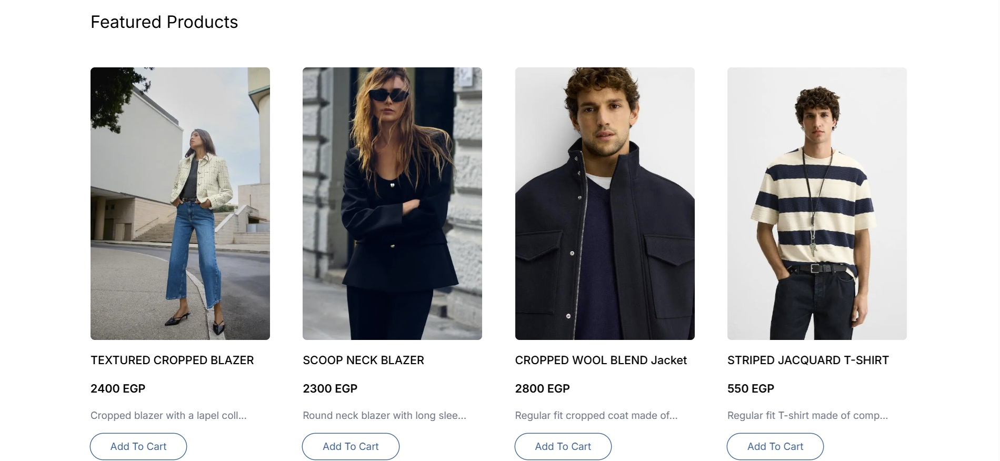
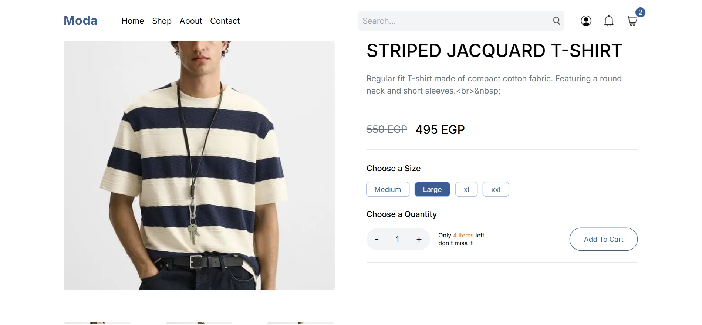
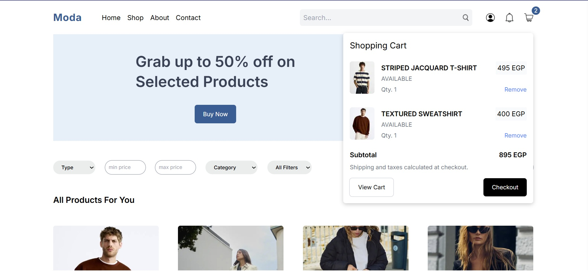

# 🛒 E-Commerce Store with CMS Dashboard (Wix)

This is a **fully-featured e-commerce store** built with **Next.js** and **Tailwind CSS**, using **Wix as a CMS dashboard** to manage products dynamically. The store supports essential e-commerce functionalities such as product customization, sorting, filtering, authentication, and more.

---

## 🚀 Features

### 🛍️ E-Commerce Functionalities

- **Product Searching, Filtering, and Sorting**
- **Cart Management** (Add, Remove, Update Quantities)
- **Product Customization** (Variants, Sizes, Quantities)
- **Pagination** for efficient product browsing

### 🔐 Authentication

- **Secure User Authentication**
- **Protected Routes for Logged-in Users**
- **Session Handling**

### 🖥️ CMS with Wix

- **Dynamic Data Management** (All product data is fetched from Wix)
- **Real-time Product Updates**
- **Centralized Product & Inventory Control**

---

## 🛠️ Tech Stack

- **[Next.js](https://nextjs.org/)** – React framework for server-rendered and statically generated web apps
- **[Tailwind CSS](https://tailwindcss.com/)** – Utility-first CSS framework for rapid UI development
- **[Zustand](https://zustand-demo.pmnd.rs/)** – Lightweight state management for better performance
- **[Wix Headless](https://dev.wix.com/docs/api/wix-headless)** – CMS for managing store products dynamically
- **[Auth.js](https://authjs.dev/)** – Authentication library for secure user login

## Screenshots

 
 

 
 

 
 

 
 

 
 

 
 

 
 

 
 

 
 
